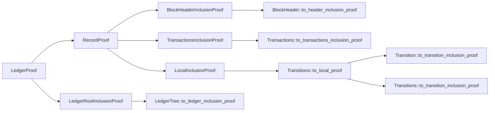

###### tags: `snarkVM_exploration`

# dpc::Ledger
Reexports
- blocks
- ledger
- ledger_proof
- ledger_tree
- local_proof
- memory_pool
- record_proof
- transitions

## ledger
```rust
pub struct Ledger<N: Network> {
    /// The canonical chain of blocks.
    canon_blocks: Blocks<N>,
    /// The set of unknown orphan blocks.
    orphan_blocks: HashMap<u32, Block<N>>,
    /// The pool of unconfirmed transactions.
    memory_pool: MemoryPool<N>,
}
```

The `Ledger` keeps track of the canonical chain (current chain), the orphan blocks (yet to be confirmed) and the unconfirmed transactions.

After a few getters we then get to the interesting stuff, which is actually altering state. `add_next_block`, `to_ledger_proof` and `to_ledger_tree` immediately call the respective method of canon_blocks, so we'll handle that later when we talk about `Blocks`. 

`add_orphan_block` is pretty straightforward, it suffices to know that it checks that the block is in fact orphan (not present in the canonical chain).
**question**: documentation says `/// Adds the given orphan block, if it is well-formed and does not already exist.` but it never validates the well-formedness of the block, is that missing or are `Block<N>` validated before constructing?

```rust 
/// Adds the given unconfirmed transaction to the memory pool.
pub fn add_unconfirmed_transaction(&mut self, transaction: &Transaction<N>) -> Result<()> {
    ensure!(
        self.canon_blocks.contains_ledger_root(&transaction.ledger_root()), 
        "Transaction references a non-existent ledger root"
    );

    // Ensure the transaction does not contain serial numbers already in the canon chain.
    for serial_number in transaction.serial_numbers() {
        ensure!(
            !self.canon_blocks.contains_serial_number(serial_number), 
            "Transaction contains a serial number already in existence"
        );
    }

    // Ensure the transaction does not contain commitments already in the canon chain.
    for commitment in transaction.commitments() {
        ensure!(
            !self.canon_blocks.contains_commitment(commitment), 
            "Transaction contains a commitment already in existence"
        );
    }

    // Attempt to add the transaction into the memory pool.
    self.memory_pool.add_transaction(transaction)?;

    Ok(())
}
```

A transaction needs to reference the canonical chain's root, and all of its serial numbers and it's commintment need to be unused in the canonical chain to be included in the transaction memory pool.

The juciest method is the `mine_next_block` method which has a few steps:
 
- Ensure that the new timestamp is ahead of the previous timestamp (it's more of a fix it if it is not ahead, it won't throw an error if it is behind).
- Compute the block difficulty (currently uses the height as well as some of the genesis_block parameters)
- Compute the cumulative weight $\sum_{b \in \text{canonical_chain}} u64_{\text{max}} / \text{difficulty}_b$ including the candidate block.
- Construct the new block transactions. Build coinbase and block transactions containing the coinbase and the mempool transactions (there's a `VirtualMaching::execute` call behind the scenes)
- Construct the block template.
- Mine the next block.
- Attempt to add the block to the canon chain.
- On **success**, clear the memory pool of its transactions.

## Blocks
```rust
pub struct Blocks<N: Network> {
    /// The current block height.
    current_height: u32,
    /// The current block hash.
    current_hash: N::BlockHash,
    /// The current ledger tree.
    ledger_tree: LedgerTree<N>,
    /// The chain of previous block hashes.
    previous_hashes: HashMap<u32, N::BlockHash>,
    /// The chain of block headers.
    headers: HashMap<u32, BlockHeader<N>>,
    /// The chain of block transactions.
    transactions: HashMap<u32, Transactions<N>>,
}
```
Most methods in `blocks.rs` are getters/setters that delegate the responsibility to either the `ledger_tree`, `previous_hashes`, `headers`, or `transactions`.

One of the 'heavy' functions is the `add_next` method, which adds a block as the latest in the canonical chain and is used by the `Ledger`. 
It runs some verifications by ensuring:
- The given block is valid
- The given block has the correct block height
- The given block height does not already exist in the ledger
- The given block has the appropiate previous block hash
- The given block hash does not already exist in the ledger
- The next block timestamp is within the declared time limit
- The given block timestamp is after the current timestamp
- The given block difficulty target is correct
- The expected cumulative weight is computed correctly
- The given cumulative weight is correct.
- Each transaction in the block does not already exist in the ledger
- Each transaction's ledger root is the same as the ledger's
- Each serial number does not exist in the ledger
- Each commitment does not exist in the ledger

And after that it attempts to add the block in each structure.

```rust 
// Add the block to the ledger. This code section executes atomically.
{
    let mut blocks = self.clone();

    blocks.current_height = height;
    blocks.current_hash = block_hash;
    blocks.ledger_tree.add(&block.hash())?;
    blocks.previous_hashes.insert(height, block.previous_block_hash());
    blocks.headers.insert(height, block.header().clone());
    blocks.transactions.insert(height, block.transactions().clone());

    *self = blocks;
}
```

**question**: why does this execute atomically? Did they actually meant that since the self is cloned you don't have race conditions? because the block does not execute atomically. 
    Is it possible to add two different blocks with the same height twice? -> No, since each `add_next` call overwrites the whole structure
    
The next method to take a look at is the to_ledger_proof. This does a bunch of things but succintly, it computes a few other proofs:



The last method to see is `assert_retarget`, which is used to compute the difficulty of the next block to be mined. It's based on the retarget algorithm used in the [zcash protocol](https://www.reference.cash/protocol/forks/2020-11-15-asert), with a few tweaked parameters.

```rust 
 /// ASERT difficulty retarget algorithm based on https://www.reference.cash/protocol/forks/2020-11-15-asert.
///     T_{i+1} = T_anchor * 2^((S - B * N) / tau).
///     T_anchor = Anchor target of a specific block height
///     B = Expected time per block.
///     S = Time elapsed since the anchor.
///     N = Number of blocks since the anchor.
///     tau = The half life of the algorithm. For every `tau` seconds ahead of
///           schedule a block’s timestamp becomes, the difficulty doubles.
/// To avoid use of floating points, we use fixed-point arithmetic.
fn asert_retarget(
    anchor_timestamp: i64,
    anchor_difficulty_target: u64,
    anchor_block_height: u32,
    block_timestamp: i64,
    block_height: u32,
    target_block_time: i64,
) -> u64 ```

## LedgerTree
The ledger tree is a merkle tree
```rust
pub struct LedgerTree<N: Network> {
    #[derivative(Debug = "ignore")]
    tree: Arc<MerkleTree<N::LedgerRootParameters>>,
    block_hashes: HashMap<N::BlockHash, u32>,
    current_index: u32,
}
```

The `tree` is the actual Merkle Tree, but the `block_hashes` are used to keep track of the blocks in the tree (lookup is faster) and to map the block hash to its respective height in the tree. The `current index keeps track of the index of the last added block in the tree`

There are two methods for adding blocks, `add` and `add_all`. Those are pretty much well documented. One thing i noticed is this piece:

```rust 
 self.tree = match self.current_index {
        0 => Arc::new(MerkleTree::<N::LedgerRootParameters>::new::<N::BlockHash>(
            Arc::new(N::ledger_root_parameters().clone()),
            block_hashes,
        )?),
        _ => Arc::new(self.tree.rebuild(self.current_index as usize, block_hashes)?),
};
```

**question**: why would you handle things differently?

**question2**: why do we do this twice?

```rust 
ensure!(
        (self.current_index as usize).saturating_add(num_block_hashes) <= u32::MAX as usize, 
        "The ledger tree will reach its maximum size."
    );
```

```rust 
self.current_index = self
        .current_index
        .checked_add(num_block_hashes as u32)
        .ok_or_else(|| anyhow!("The index exceeds the maximum number of allowed block hashes."))?;
    let end_index = self.current_index.checked_sub(1).ok_or_else(|| anyhow!("Integer underflow."))?;
```

The rest of the methods are getters and setters, the `MerkleTree` takes care of the inclusion proof:

```rust
/// Returns the Merkle path for a given block hash.
fn to_ledger_inclusion_proof(&self, block_hash: &N::BlockHash) -> Result<MerklePath<N::LedgerRootParameters>> {
    match self.get_block_hash_index(block_hash) {
        Some(index) => Ok(self.tree.generate_proof(*index as usize, block_hash)?),
        _ => Err(MerkleError::MissingLeaf(format!("{}", block_hash)).into()),
    }
}
```

## Transitions
```rust
pub(crate) struct Transitions<N: Network> {
    #[derivative(Debug = "ignore")]
    tree: Arc<MerkleTree<N::TransactionIDParameters>>,
    transitions: HashMap<N::TransitionID, (u8, Transition<N>)>,
    current_index: u8,
}
```
As the LedgerTree, this is also a wrapper of a Merkle Tree used for storing a set of Transitions.

IN FACT, **question**: Is this abstractable?

The method that differs a bit is the `to_local_proof` one, which gets the corresponding transition for the commitment, and makes an inclusion proof of the commitment in the transition and the transition in the transition tree.

```rust 
 /// Returns the local proof for a given commitment.
    pub(crate) fn to_local_proof(&self, commitment: N::Commitment) -> Result<LocalProof<N>> {
        let (_, (_, transition)) = match self
            .transitions
            .iter()
            .filter(|(_, (_, transition))| transition.contains_commitment(&commitment))
            .last()
        {
            Some(tuple) => tuple,
            None => return Err(MerkleError::MissingLeaf(format!("{}", commitment)).into()),
        };

        let transition_id = transition.transition_id();
        let transition_inclusion_proof = transition.to_transition_inclusion_proof(commitment)?;
        let transaction_id = self.root();
        let transaction_inclusion_proof = self.to_transition_path(transition_id)?;

        LocalProof::new(
            transaction_id,
            transaction_inclusion_proof,
            transition_id,
            transition_inclusion_proof,
            commitment,
        )
    }
```
