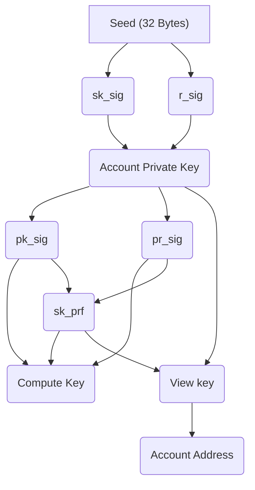

# Account

## Inside Account
- account
- address
- compute_key
- private_key
- view_key

## Account
The account is an struct containing the following fields
```rust 
pub struct Account<N: Network> {
    private_key: PrivateKey<N>,
    view_key: ViewKey<N>,
    address: Address<N>,
}
```

An account can be created with the `new` function that receives an rng (random number generator) and creates a new account from a new `PrivateKey`.

It has some getters for every field of the account struct `private_key`, `view_key`, and `address`. The first one returns a reference and the address one returns an owned address.

The account implements the `From` trait too, which receives an already created `PrivateKey` to create an account. This would create the address and view key from that private key and then return a new account with that data.

## Address
This is a struct representing the address for an account containing the corresponding key.
```rust 
pub struct Address<N: Network>(<N::AccountEncryptionScheme as EncryptionScheme>::PublicKey);
```

This address associated with an account enables users to interact with one another, sending and receiving records that encode values and application data. The address has a public key for the account encryption scheme.
It has different ways to create an address: 
- From a private key
- From a compute key 
- From a view key.

The functions are `from_private_key`, `from_compute_key` and `from_view_key`. It also has implementations for the `From` trait with all the different keys.

**question:** Is this really necessary? we can keep the functions or the from trait.

The implementation of the one that receives the private key just transform that key to a compute key and then generates the view key that the address will use.
The one that receives the view key generates a public key with that view key and use that as the key that the address will use.

The address can be created with a string too, the string being the address of that account. The address has to match some specific characteristics to be a valid address: 
- It has to be 63 characters long
- It has to be in [bech32m](https://river.com/learn/terms/b/bech32-modified/) format. It used bech32 format before, but now it's deprecated and uses it's modified version.
- The address prefix must be "aleo1". 
With that specific String, it generates the proper key associated with that address using elliptic curves cryptography.

Then there's a `verify_signature` function that verifies a signature on a message signed by the account key. This function returns true or false depending on if the signature has signed a given message or false if not. This function has two parameters: 
- the first one is the message: an array of booleans representing the sequence of bits of the message that was signed.
- The other it's the signature that we want to verify.
This function calls a verify function defined in the signature module that we'll see in that chapter.

## Compute key

The compute key is represented with the following struct:
```rust
pub struct ComputeKey<N: Network> {
    /// pk_sig := G^sk_sig.
    pk_sig: N::ProgramAffineCurve,
    /// pr_sig := G^r_sig.
    pr_sig: N::ProgramAffineCurve,
    /// sk_prf := RO(G^sk_sig || G^r_sig).
    sk_prf: N::ProgramScalarField,
}
```
Right now the compute key can not be created with the `new` function. That function is only for internal use. The public way to do it is from a private key with the function `from_private_key` which receives a created private key and computes the `pk_sig` and `pr_sig` to create the compute key.

It can be created with a Signature with the function `from_signature`, it extracts the `pk_sig` and `pr_sig` from the signature and uses that to create the correct compute key.

There are some getters that return a reference to all the fields in the struct and a function called `is_valid` that returns a boolean indicating if the compute key is well-formed or not.
Basically, the validation recomputes the `sk_prf` with the `pk_sig` and `pr_sig` that are in the struct and check that matches with the `sk_prf` already saved in the compute key.

It has a function to get an encryption key from the compute key. The function `to_encryption_key` takes the `pk_sig` and `pr_sig` converts them into it's projective representation and then adds them together with a `pk_prf` a scalar generated from the `sk_prf`. 

## Private Key

The private key is represented with the following struct:
```rust
pub struct PrivateKey<N: Network> {
    seed: N::AccountSeed,
    pub(super) sk_sig: N::ProgramScalarField,
    pub(super) r_sig: N::ProgramScalarField,
}
```

This private key is used to authorize a transaction, which updates the global state of account records. The private key should never be shared with any third parties, users should derive the key into another type of key to allow third parties to do actions trustless. 
In this case, it doesn't have the getters so the data of the struct is private except for the super crates.

It has a `new` function that receives an rng to create the seed. The private key would be constructed following the next steps: 
- Create the 32-byte randomly-sampled account `seed`. 
- Then `sk_sig` and `r_sig` are calculated with the seed and two domain separators **AleoAccountSeedSignatureSecretKey0** and **AleoAccountSeedSignatureRandomizer0**.
- Create preimage 
- Evaluate using [Poseidon Hash Function](https://eprint.iacr.org/2019/458.pdf)

There are a few functions that transform the private key to another entity like `to_address`, `to_compute_key` and `to_decryption_key` that use the `sk_sig`, `r_sig` and the `sk_prf` calculated transforming the private key to a compute key.

In the function `is_valid` it transforms the private key into a compute key and calls the function mentioned above.

There is a function called `sign` that signs a message using the private key. It receives two things:
- The message: an array of booleans representing the sequence of bits of the message that is going to be signed.
- A rng to sample a random scalar field element.

The sign function in the private key module uses a sign function in another signature module so we'll see that implementation in that chapter.

Lastly, there is a `from_str` function to create a private key from a string.
The private key has to match some specific characteristics to be a valid private key: 
- It has to be 59 characters long
- It has to be in [base58](https://tools.ietf.org/id/draft-msporny-base58-01.html) format.
- The private key prefix must be "APrivateKey1". 

## View Key 

The view key is used to decrypt account records which are encrypted under the user's account address. Is derived from an account private key. This key is useful to access every record in a user's account, so it could be used by third parties to verify the history of an account.
The view key is represented with a tuple struct containing the corresponding private key as the element of the tuple:

```rust
pub struct ViewKey<N: Network>(<N::AccountEncryptionScheme as EncryptionScheme>::PrivateKey);
```

The view key can be created from a private key, it has the function `from_private_key` and also implements the `From` trait.

There is a `from_str` function to create a view key from a string. The view key has to match some specific characteristics to be a valid view key:
- It has to be 53 characters long.
- It has to be in [base58](https://tools.ietf.org/id/draft-msporny-base58-01.html) format.
- The view key prefix must be "AViewKey1"

## Account Diagram


