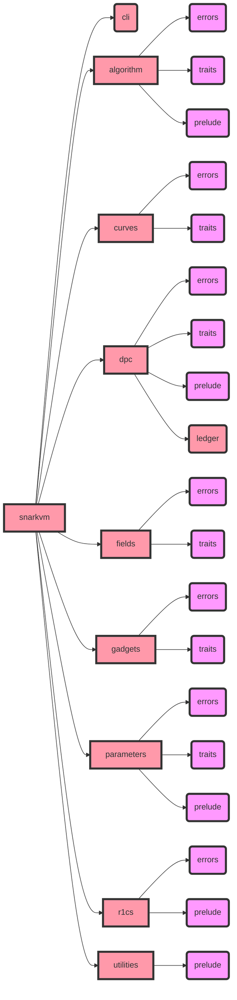

# snarkVM

```mermaid
flowchart LR 

style A fill:#f9a,stroke:#333,stroke-width:4px
style B fill:#f9a,stroke:#333,stroke-width:4px
style C fill:#f9a,stroke:#333,stroke-width:4px
style C1 fill:#f9f,stroke:#333,stroke-width:4px
style C2 fill:#f9f,stroke:#333,stroke-width:4px
style C3 fill:#f9f,stroke:#333,stroke-width:4px
style D fill:#f9a,stroke:#333,stroke-width:4px
style D1 fill:#f9f,stroke:#333,stroke-width:4px
style D2 fill:#f9f,stroke:#333,stroke-width:4px
style E fill:#f9a,stroke:#333,stroke-width:4px
style E1 fill:#f9f,stroke:#333,stroke-width:4px
style E2 fill:#f9f,stroke:#333,stroke-width:4px
style E3 fill:#f9f,stroke:#333,stroke-width:4px
style E4 fill:#f9a,stroke:#333,stroke-width:4px
style F fill:#f9a,stroke:#333,stroke-width:4px
style F1 fill:#f9f,stroke:#333,stroke-width:4px
style F2 fill:#f9f,stroke:#333,stroke-width:4px
style G fill:#f9a,stroke:#333,stroke-width:4px
style G1 fill:#f9f,stroke:#333,stroke-width:4px
style G2 fill:#f9f,stroke:#333,stroke-width:4px
style H fill:#f9a,stroke:#333,stroke-width:4px
style H1 fill:#f9f,stroke:#333,stroke-width:4px
style H2 fill:#f9f,stroke:#333,stroke-width:4px
style H3 fill:#f9f,stroke:#333,stroke-width:4px
style I fill:#f9a,stroke:#333,stroke-width:4px
style I1 fill:#f9f,stroke:#333,stroke-width:4px
style I2 fill:#f9f,stroke:#333,stroke-width:4px
style J fill:#f9a,stroke:#333,stroke-width:4px
style J2 fill:#f9f,stroke:#333,stroke-width:4px


A[snarkvm] --> B(cli)
A[snarkvm] --> C(algorithms)

C[algorithm] --> C1(errors)
C[algorithm] --> C2(traits)
C[algorithm] --> C3(prelude)

A[snarkvm] --> D(curves)

D[curves] --> D1(errors)
D[curves] --> D2(traits)

A[snarkvm] --> E(dpc)

E[dpc] --> E1(errors)
E[dpc] --> E2(traits)
E[dpc] --> E3(prelude)
E[dpc] --> E4(ledger)

A[snarkvm] --> F(fields)

F[fields] --> F1(errors)
F[fields] --> F2(traits)

A[snarkvm] --> G(gadgets)

G[gadgets] --> G1(errors)
G[gadgets] --> G2(traits)

A[snarkvm] --> H(parameters)

H[parameters] --> H1(errors)
H[parameters] --> H2(traits)
H[parameters] --> H3(prelude)

A[snarkvm] --> I(r1cs)
I[r1cs] --> I1(errors)
I[r1cs] --> I2(prelude)

A[snarkvm] --> J(utilities)
J[utilities] --> J2(prelude)
```
