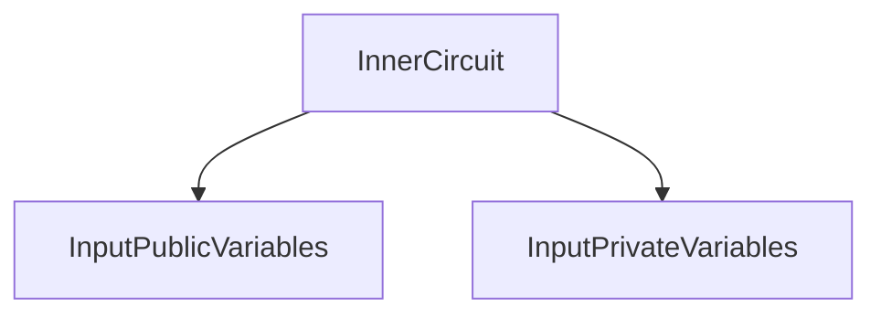
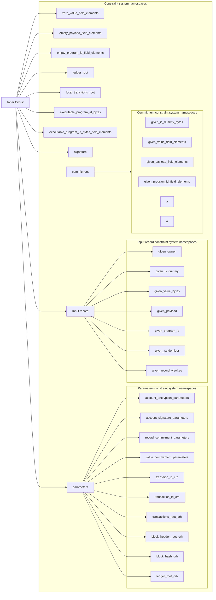

# Input Circuit

## What is an input circuit?

An input circuit is a constraint synthesizer that can generate constraints with public and private variables for a given constraint system.

This definition may be a lot to take in at first, so lets try explain a little bit the concepts within it. But its worth saying that I'll only explain the concepts that are relevant to snarkVM's implementation, I'll leave a link to the concepts that are independent from snarkVM's implementation.

> Computations are expressed in terms of rank-1 constraint systems [R1CS](https://docs.circom.io/background/background/#rank-1-constraint-system).

### Constraint Synthesizer

```rust
/// Computations are expressed in terms of rank-1 constraint systems (R1CS).
/// The `generate_constraints` method is called to generate constraints for
/// both CRS generation and for proving.
pub trait ConstraintSynthesizer<F: Field> {
    /// Drives generation of new constraints inside `CS`.
    fn generate_constraints<CS: ConstraintSystem<F>>(&self, cs: &mut CS) -> Result<(), SynthesisError>;
}
```

A Constraint Synthesizer drives the generation of new constraints inside a Constraint System.

### Constraint System

```rust
/// Represents a constraint system which can have new variables
/// allocated and constrains between them formed.
pub trait ConstraintSystem<F: Field>: Sized {
    /// Represents the type of the "root" of this constraint system
    /// so that nested namespaces can minimize indirection.
    type Root: ConstraintSystem<F>;

    /// Return the "one" input variable
    fn one() -> Variable {
        Variable::new_unchecked(Index::Public(0))
    }

    /// Allocate a private variable in the constraint system. The provided
    /// function is used to determine the assignment of the variable. The
    /// given `annotation` function is invoked in testing contexts in order
    /// to derive a unique name for this variable in the current namespace.
    fn alloc<FN, A, AR>(&mut self, annotation: A, f: FN) -> Result<Variable, SynthesisError>
    where
        FN: FnOnce() -> Result<F, SynthesisError>,
        A: FnOnce() -> AR,
        AR: AsRef<str>;

    /// Allocate a public variable in the constraint system. The provided
    /// function is used to determine the assignment of the variable.
    fn alloc_input<FN, A, AR>(&mut self, annotation: A, f: FN) -> Result<Variable, SynthesisError>
    where
        FN: FnOnce() -> Result<F, SynthesisError>,
        A: FnOnce() -> AR,
        AR: AsRef<str>;

    /// Enforce that `A` * `B` = `C`. The `annotation` function is invoked in
    /// testing contexts in order to derive a unique name for the constraint
    /// in the current namespace.
    fn enforce<A, AR, LA, LB, LC>(&mut self, annotation: A, a: LA, b: LB, c: LC)
    where
        A: FnOnce() -> AR,
        AR: AsRef<str>,
        LA: FnOnce(LinearCombination<F>) -> LinearCombination<F>,
        LB: FnOnce(LinearCombination<F>) -> LinearCombination<F>,
        LC: FnOnce(LinearCombination<F>) -> LinearCombination<F>;

    /// Create a new (sub)namespace and enter into it. Not intended
    /// for downstream use; use `namespace` instead.
    fn push_namespace<NR, N>(&mut self, name_fn: N)
    where
        NR: AsRef<str>,
        N: FnOnce() -> NR;

    /// Exit out of the existing namespace. Not intended for
    /// downstream use; use `namespace` instead.
    fn pop_namespace(&mut self);

    /// Gets the "root" constraint system, bypassing the namespacing.
    /// Not intended for downstream use; use `namespace` instead.
    fn get_root(&mut self) -> &mut Self::Root;

    /// Begin a namespace for this constraint system.
    fn ns<NR, N>(&mut self, name_fn: N) -> Namespace<'_, F, Self::Root>
    where
        NR: AsRef<str>,
        N: FnOnce() -> NR,
    {
        self.get_root().push_namespace(name_fn);

        Namespace(self.get_root(), PhantomData)
    }

    /// Output the number of constraints in the system.
    fn num_constraints(&self) -> usize;

    /// Output the number of public input variables to the system.
    fn num_public_variables(&self) -> usize;

    /// Output the number of private input variables to the system.
    fn num_private_variables(&self) -> usize;

    /// Output whether the constraint system is in the setup mode.
    fn is_in_setup_mode(&self) -> bool;
}
```

A constraint system can have new variables (signals) allocated and constrains that are formed between them. 
Structs that implement the `ConstraintSystem` trait can:
- Allocate private and public variables.
- Enforce that  A * B = C, being A, B and C linear combinations with coefficients in a given field.
- Enter into new (sub)namespaces and exit from them.
- Begin a namespace for its system.

## Namespace

Namespaces are a kind of constraint system which borrows a constraint system (pushing a namespace context) and, when dropped, pops out  the namespace context. 
Namespaces can never be a root constraint system.

The structure an input circuit is the following:

```rust
pub struct InputCircuit<N: Network> {
    public: InputPublicVariables<N>,
    private: InputPrivateVariables<N>,
}
```

### Input Public Variable

```rust
pub struct InputPublicVariables<N: Network> {
    /// The serial number of the input record.
    serial_number: N::SerialNumber,
    /// The commitments on the input record value.
    input_value_commitment: N::ValueCommitment,
    ledger_root: N::LedgerRoot,
    local_transitions_root: N::TransactionID,
    // These are required in natively verifying an inner circuit proof.
    // However for verification in the outer circuit, these must be provided as witness.
    /// Program ID
    pub(super) program_id: Option<N::ProgramID>,
}
```

Input public variables are structs that contain the *serial number* of an input record, the *input value commitment* that is the value of the commitments on the input record value, the *ledger root*, the *local transactions root* of type `N::TransactionID` and a *program id* of type `N::ProgramID`. The last are required in natively verifying an input circuit proof. However for verification in the outer circuit, these might be provided as witness.
They can be created blank with default values using `InputVariables::blank` or with specific values using `InputVariables::new` passing the pertinent arguments for its building.
The can be turned into field elements, this is a vector of `InnerScalarField`s.

### Input Private Variable

```rust
pub struct InputPrivateVariables<N: Network> {
    // Inputs.
    pub(super) input_record: Record<N>,
    pub(super) ledger_proof: LedgerProof<N>,
    pub(super) signature: N::AccountSignature,

    pub(super) input_value_commitment_randomness: N::ProgramScalarField,
}
```

Input private variables are structs that contain an *input record*, a *ledger proof*, a *signature* and an *input value commitment randomness*, that is a `ProgramScalarField` (an alias for `PrimeField` trait).
Like public variables the can be blank or not.

Well, now we have a better context. We know what it means to be an input circuit, what it does, who interact, and where it works. But, how does it generate a constraint?

### Constraints Generation

To generate constraints means:

1. Declare this variables as namespaces and field elements.
2. Check that the record is well-formed.
3. Check that the serial number is derived correctly.
4. Check that the commitment appears on the ledger or prior transition (i.e. the membership witness is valid with respect to the ledger root). 
5. Check that the input value commitment is derived correctly.
6. Check that the signature is valid.

For a more in-deph understanding of the constraints generation, this is the complete workflow:

#### Declare this variables as namespaces and field elements
- Declare a ledger root.
- Declare the local transitions root.
- Declare the program ID.
- Declare the transition signature.
- Declare parameters.
    - Declare the account encryption parameters.
    - Declare the account signature parameters.
    - Declare the record commitment parameters.
    - Declare the record value commitment parameters.
    - Declare the transition ID CRH parameters.
    - Declare the transaction CRH parameters.
    - Declare the transactions root CRH parameters.
    - Declare the block header root CRH parameters.
    - Declare the block hash CRH parameters.
    - Declare the ledger root CRH parameters.
- Declare record contents.
    *There is no need to check that commitments, keys and hashes are in prime order subgroup because the commitment and CRH parameters are trusted, and so when we recompute these, the newly computed values will always be in correct subgroup. If the input cm, pk, or hash is incorrect, then it will not match the computed equivalent.*
    - Declare the given owner.
    - Declare the given is dummy.
    - Declare the given values in bytes.
    - Declare the given payload (empty if the record does not have one).
    - Declare the given program id (empty program id if the record does not have one).
    - Declare the given randomizer.
    - Declare the given record view key.

#### Check that the record is well-formed.
- Convert the owner, dummy flag, value, payload, program ID, and randomizer into bits.
    - Convert given is dummy to bytes.
    - Convert given value to field elements.
    - Convert given payload to field elements.
    - Convert given program ID to field elements.
    - Perform noop safety checks.
        - If the input record is empty, enforce it has a value of 0.
        - If the input record is empty, enforce it has an empty payload.
        - If the input record is empty, enforce it has an empty program ID.
        - Ensure the program ID matches the declared program ID.
- Compute the record commitment and check that it matches the declared commitment.
    - Declare given owner gadget.
    - Encode input value (given value in bytes).
    - Encode input payload (given payload).
    - Produce a ciphertext Check encryption from symmetric key: a ciphertext is produced out of the given record viewkey and the plaintext (the plaintext includes the encoded given value and the encoded given payload).
    - Produce the record view key commitment with the given record view key.
    - Construct a commitment input with the given randomizer, the record view key commitment, the ciphertext, the given program id and the given is dummy flag (all as bytes).
    - Build the candidate commitment with the record commitment parameters and the commitment input.

#### Check that the serial number is derived correctly.
- Compute a candidate serial number out of the computed key for a signature and the commitment. 
- Declare given serial number with the public variable's serial number.
- Check that the candidate serial number is equal to the given serial number.

#### Check that the commitment appears on the ledger or prior transition (i.e. the membership witness is valid with respect to the ledger root).
- Ensure each commitment is either 1) in the ledger, 2) from a prior local transition, or 3) a dummy (checking the ledger proof).
- Compute the transition ID declaring the transition ID inclusion proof.
- Compute a candidate transition id performing the transition inclusion proof computation with the transition id CRH and the commitment.
- Compute the transaction ID declaring the transaction ID inclusion proof.
- Compute a candidate transaction id performing the transaction inclusion proof computation with the transaction id CRH and the commitment.
- Determine if the commitment in local checking if the local transitions root matches the candidate transaction ID.
- Determine if the commitment is local or dummy.
- Compute the transaction root declaring the ledger transactions root inclusion proof and performing the ledger transactions root inclusion proof computation with the transactions root CRH and the candidate transaction id.
- Compute the block header root declaring the ledger block header root inclusion proof and performing the ledger block header root inclusion proof computation with the block header root CRH and the candidate ledger transactions root.
- Declare the previous block hash with the ledger proof.
- Construct the block hash preimage with the previous block hash and the candidate block header root.
- Ensure the ledger root inclusion proof is valid declaring the ledger root inclusion proof and performing the ledger root inclusion proof check with the ledger root CRH, the ledger root, the candidate block hash, and the is local or dummy flag.

#### Check that the input value commitment is derived correctly.
- Declare the value commitment randomness.
- Declare the given value commitment.
- Compute the input value commitment candidate with the value commitment randomness.
- Check that the input value commitment is valid by comparing the candidate value commitment and the given value commitment.

#### Check that the signature is valid.
- Construct the signature with the candidate commitment and the input program id.
- Convert the signature to bits.
- Compute the signature the signature with the account signature parameters and the public key, the signature message, and the signature.
- Check the signature verification 

## Inner Circuit




## Inner Circuit Generation




## Yet to be answered questions
...
