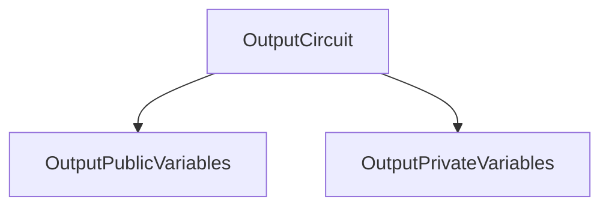

# Output Circuit

## What is an output circuit?

An output circuit is a constraint synthesizer that can generate constraints with public and private variables for a given constraint system.

This definition may be a lot to take in at first, so lets try explain a little bit the concepts within it. But its worth saying that I'll only explain the concepts that are relevant to snarkVM's implementation, I'll leave a link to the concepts that are independent from snarkVM's implementation.

> Computations are expressed in terms of rank-1 constraint systems [R1CS](https://docs.circom.io/background/background/#rank-1-constraint-system).

### Constraint Synthesizer

```rust
/// Computations are expressed in terms of rank-1 constraint systems (R1CS).
/// The `generate_constraints` method is called to generate constraints for
/// both CRS generation and for proving.
pub trait ConstraintSynthesizer<F: Field> {
    /// Drives generation of new constraints inside `CS`.
    fn generate_constraints<CS: ConstraintSystem<F>>(&self, cs: &mut CS) -> Result<(), SynthesisError>;
}
```

A Constraint Synthesizer drives the generation of new constraints inside a Constraint System.

### Constraint System

```rust
/// Represents a constraint system which can have new variables
/// allocated and constrains between them formed.
pub trait ConstraintSystem<F: Field>: Sized {
    /// Represents the type of the "root" of this constraint system
    /// so that nested namespaces can minimize indirection.
    type Root: ConstraintSystem<F>;

    /// Return the "one" output variable
    fn one() -> Variable {
        Variable::new_unchecked(Index::Public(0))
    }

    /// Allocate a private variable in the constraint system. The provided
    /// function is used to determine the assignment of the variable. The
    /// given `annotation` function is invoked in testing contexts in order
    /// to derive a unique name for this variable in the current namespace.
    fn alloc<FN, A, AR>(&mut self, annotation: A, f: FN) -> Result<Variable, SynthesisError>
    where
        FN: FnOnce() -> Result<F, SynthesisError>,
        A: FnOnce() -> AR,
        AR: AsRef<str>;

    /// Allocate a public variable in the constraint system. The provided
    /// function is used to determine the assignment of the variable.
    fn alloc_output<FN, A, AR>(&mut self, annotation: A, f: FN) -> Result<Variable, SynthesisError>
    where
        FN: FnOnce() -> Result<F, SynthesisError>,
        A: FnOnce() -> AR,
        AR: AsRef<str>;

    /// Enforce that `A` * `B` = `C`. The `annotation` function is invoked in
    /// testing contexts in order to derive a unique name for the constraint
    /// in the current namespace.
    fn enforce<A, AR, LA, LB, LC>(&mut self, annotation: A, a: LA, b: LB, c: LC)
    where
        A: FnOnce() -> AR,
        AR: AsRef<str>,
        LA: FnOnce(LinearCombination<F>) -> LinearCombination<F>,
        LB: FnOnce(LinearCombination<F>) -> LinearCombination<F>,
        LC: FnOnce(LinearCombination<F>) -> LinearCombination<F>;

    /// Create a new (sub)namespace and enter into it. Not intended
    /// for downstream use; use `namespace` instead.
    fn push_namespace<NR, N>(&mut self, name_fn: N)
    where
        NR: AsRef<str>,
        N: FnOnce() -> NR;

    /// Exit out of the existing namespace. Not intended for
    /// downstream use; use `namespace` instead.
    fn pop_namespace(&mut self);

    /// Gets the "root" constraint system, bypassing the namespacing.
    /// Not intended for downstream use; use `namespace` instead.
    fn get_root(&mut self) -> &mut Self::Root;

    /// Begin a namespace for this constraint system.
    fn ns<NR, N>(&mut self, name_fn: N) -> Namespace<'_, F, Self::Root>
    where
        NR: AsRef<str>,
        N: FnOnce() -> NR,
    {
        self.get_root().push_namespace(name_fn);

        Namespace(self.get_root(), PhantomData)
    }

    /// Output the number of constraints in the system.
    fn num_constraints(&self) -> usize;

    /// Output the number of public output variables to the system.
    fn num_public_variables(&self) -> usize;

    /// Output the number of private output variables to the system.
    fn num_private_variables(&self) -> usize;

    /// Output whether the constraint system is in the setup mode.
    fn is_in_setup_mode(&self) -> bool;
}
```

A constraint system can have new variables (signals) allocated and constrains that are formed between them. 
Structs that implement the `ConstraintSystem` trait can:
- Allocate private and public variables.
- Enforce that  A * B = C, being A, B and C linear combinations with coefficients in a given field.
- Enter into new (sub)namespaces and exit from them.
- Begin a namespace for its system.

## Namespace

Namespaces are a kind of constraint system which borrows a constraint system (pushing a namespace context) and, when dropped, pops out  the namespace context. 
Namespaces can never be a root constraint system.

The structure an output circuit is the following:

```rust
pub struct OutputCircuit<N: Network> {
    public: OutputPublicVariables<N>,
    private: OutputPrivateVariables<N>,
}
```

### Output Public Variable

```rust 
pub struct OutputPublicVariables<N: Network> {
    /// The commitment of the output record.
    commitment: N::Commitment,
    /// The commitments on the output record value.
    output_value_commitment: N::ValueCommitment,
    // These are required in natively verifying an inner circuit proof.
    // However for verification in the outer circuit, these must be provided as witness.
    /// Program ID
    pub(super) program_id: Option<N::ProgramID>,
}
```

Output public variables are structs that contain the *commitment* of an output record, the *output value commitment* that is the value of the commitments on the output record value and a *program id* of type `N::ProgramID`. The last are required in natively verifying an output circuit proof. However for verification in the outer circuit, these might be provided as witness.
They can be created blank with default values using `OutputVariables::blank` or with specific values using `OutputVariables::new` passing the pertinent arguments for its building.
The can be turned into field elements, this is a vector of `InnerScalarField`s.

### Output Private Variable

```rust
pub struct OutputPrivateVariables<N: Network> {
    // Outputs.
    pub(super) output_record: Record<N>,
    pub(super) encryption_randomness: <N::AccountEncryptionScheme as EncryptionScheme>::ScalarRandomness,

    pub(super) output_value_commitment_randomness: N::ProgramScalarField,
}
```

Output private variables are structs that contain an *output record*, an *encryption_randomness* that is in fact an `N::AccountEncryptionScheme` and an *output_value_commitment_randomness* that is a `ProgramScalarField` (an alias for `PrimeField` trait).
Like public variables the can be blank or not.

Well, now we have a better context. We know what it means to be an output circuit, what it does, who interact, and where it works. But, how does it generate a constraint?

### Constraints Generation

To generate constraints for an output circuit means:

1. Declare this variables as namespaces and field elements.
2. Check that the record is well-formed.
3. Check that the output value commitment is derived correctly.

For a more in-depth understanding of the constraints generation, this is the complete workflow:

#### Declare this variables as namespaces and field elements
- Declare the program ID.
    - The program ID is turned into bytes (le).
    - This ID in bytes is allocated as `executable_program_id` in a namespace.
    - The executable program ID is converted to field elements.
- Declare parameters.
    - Declare the account encryption parameters.
    - Declare the record commitment parameters.
    - Declare the value commitment parameters.
- Process the output record.
    - 

#### Check that the record is well-formed.
- Convert the owner, dummy flag, value, payload, program ID, and randomizer into bits.
    - Convert given is dummy to bytes.
    - Convert given value to field elements.
    - Convert given payload to field elements.
    - Convert given program ID to field elements.
    - Perform noop safety checks.
        - If the output record is empty, enforce it has a value of 0.
        - If the output record is empty, enforce it has an empty payload.
        - If the output record is empty, enforce it has an empty program ID.
        - Ensure the program ID matches the declared program ID.
- Check that the record ciphertext and commitment are well-formed.
    - Declare given owner gadget.
    - Encode the output value (given value in bytes).
    - Encode the output payload (given payload in bytes).
    - Allocate the output record encryption randomness.
    - Construct a plaintext with the given owner gadget, the encoded given value, and the encoded given payload.
    - Compute the candidate ciphertext randomizer, the candidate ciphertext, the record view key with the account encryption parameters, the encryption randomness, the given owner and the plaintext.
    - Ensure that the given randomizer is correct.
- Compute the record commitment and check that it matches the declared commitment.
    - Compute the record view key commitment with the account encryption parameters and the record view key. This is the output record check symmetric key commitment.
    - Convert the given randomizer to bytes.
    - Convert the record view key commitment to bytes.
    - Convert the output ciphertexts into bytes.
    - Construct a commitment input with the given randomizer, the record view key commitment, the ciphertexts, the given program id and the given is dummy (all in bytes).
    - Compute the candidate commitment.
    - Allocate the given output commitment-
    - Enforce that the output commitment is equal to the candidate commitment (valid).

#### Check that the output value commitment is derived correctly.
- Declare the value commitment randomness.
- Declare the given value commitment.
- Compute the output value commitment candidate with the value commitment randomness.
- Check that the output value commitment is valid by comparing the candidate value commitment and the given value commitment.

## Output Circuit



## Yet to be answered questions
...
